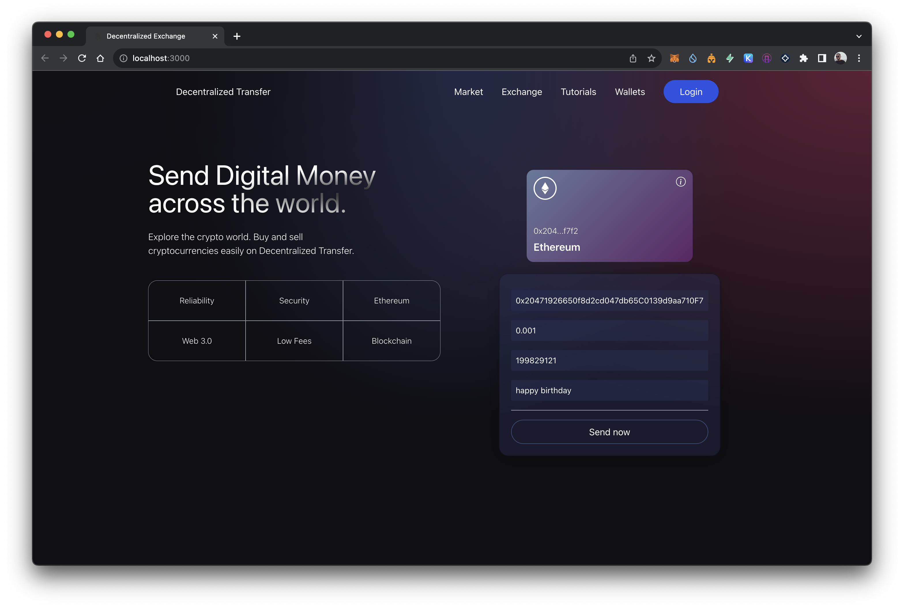

# Decentralized Transfer




Decentralized Transfer is a web3.0 website built with React and Solidity, enabling seamless cross-border crypto transactions via the Goerli testnet. It connects with Metamask, a secure, decentralized wallet.

## Features

- Cross-border crypto transactions: Users can transfer cryptocurrencies across borders using the Goerli testnet.
- Web3 integration: The website integrates with the web3 library to interact with the Ethereum blockchain.
- Metamask integration: Users can connect their Metamask wallet to securely manage their crypto assets.
- User-friendly interface: The website provides an intuitive and user-friendly interface for easy navigation and transaction management.

## Prerequisites

Before running the project, make sure you have the following prerequisites installed:

- Node.js: [Download and install Node.js](https://nodejs.org/en/download/)
- Metamask: [Install Metamask](https://metamask.io/) and set up an account on the Goerli testnet.

## Installation

1. Clone the repository:

```bash
   git clone https://github.com/your-username/decentralized-transfer.git
```

2. Navigate to the project directory:

```bash
   cd decentralized-transfer
```

3. Install the dependencies:

```bash
       npm install
```

## Usage

1. Start the development server:

```bash
   npm start
```

2. Open your web browser and go to http://localhost:3000 to access the Decentralized Transfer website.

3. Connect your Metamask wallet to the website and follow the on-screen instructions to perform cross-border crypto transactions.

## Contributing

Contributions are welcome! If you find any issues or have suggestions for improvements, please open an issue or submit a pull request.
